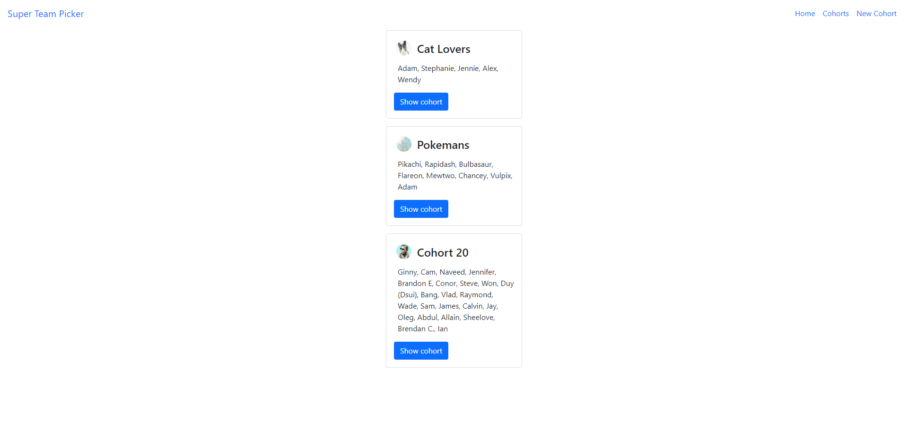
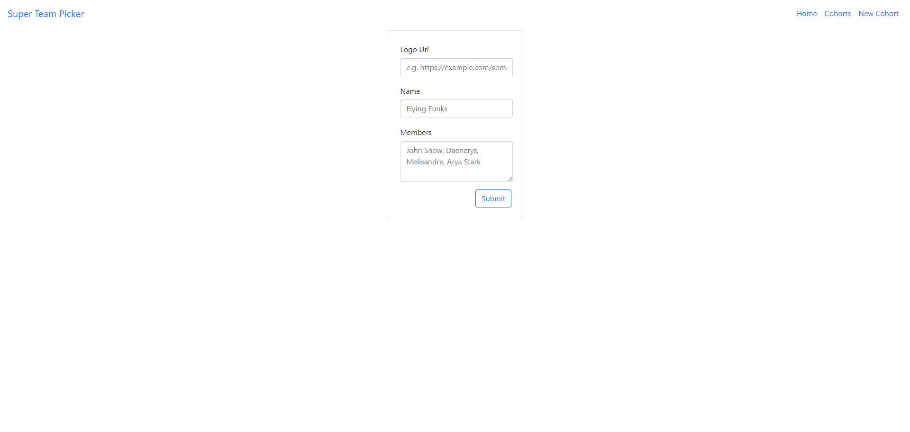
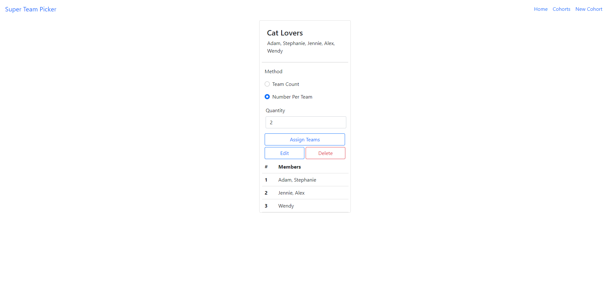
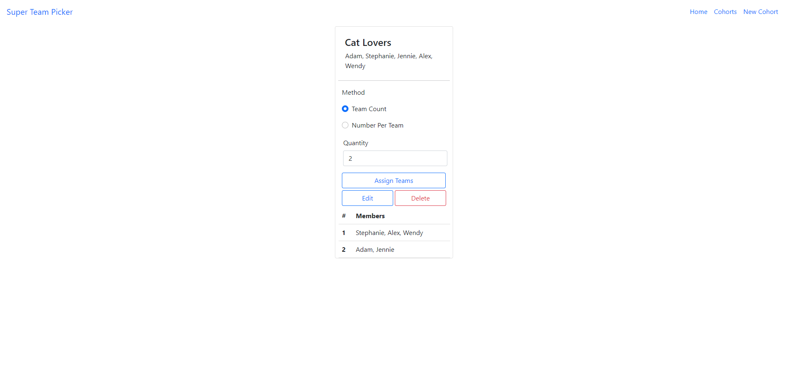

# Super Team Picker

Super Team Picker is a web application built with Node and Express that allows users to:
- Create, edit and delete cohorts
- Randomly generate teams based on selected methods: team count/ number per team

## Demo Link
YouTube: https://youtu.be/XdJQSqc3XBE

## Final Product

## Dependencies
- Node.js
- Express
- EJS
- body-parser
- knex
- method-override
- morgan
- pg

## Dev Dependencies
- nodemon

## Styling
- Bootstrap v5.1.3

## Getting Started
- Install all dependencies using the `npm` command
- Set up database using Knex and PostgreSQL
- Run the server using `npm start` command

# File Structure

## Server and Router
- index.js
- cohorts.js
- assign.js

## Views
- footer.js
- formInput.ejs
- header.ejs
- edit.ejs
- index.ejs
- new.ejs
- show.ejs
- home.ejs
